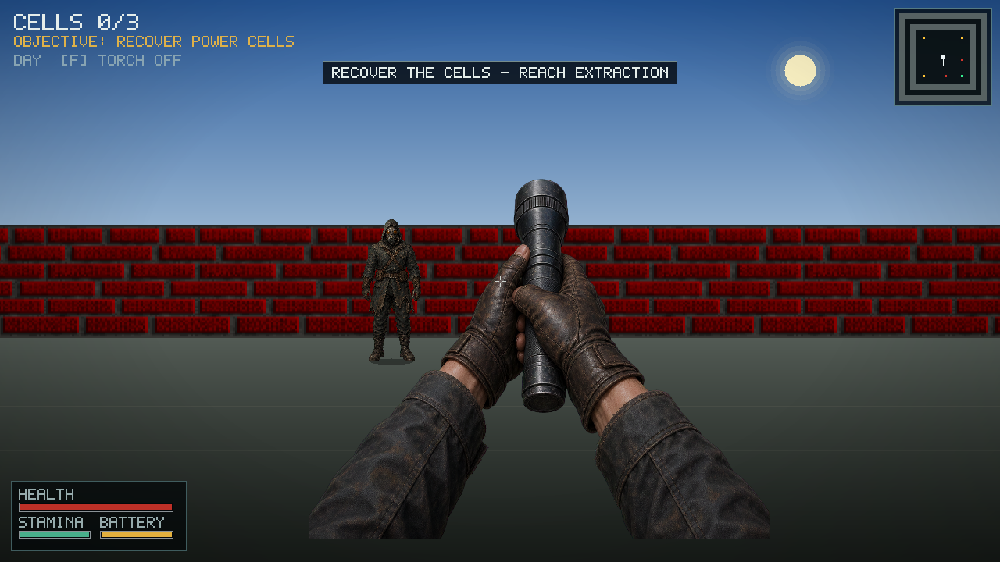

# Bunker Run

**Bunker Run** is a compact first-person survival game and C raycasting engine
built with SDL2 and SDL2_image. Enter one of three bunker zones, recover every
power cell, control the sentinels with your torch, and reach extraction
before they drain your health.



## Gameplay

Every zone has a deterministic layout and object placement: three power cells,
two sentinels, an extraction marker, and solid barrel and pillar props. There
are no random spawns.

1. Select an infiltration zone from the title screen.
2. Explore while managing health, sprint stamina, and finite torch battery.
3. Get close to each power cell and interact to collect it. A cell restores
   torch battery power.
4. Keep sentinels inside the torch beam. Sustained light forces them back
   and eventually neutralizes them; outside the beam they pursue and damage
   you at close range.
5. After collecting all three cells, interact with the extraction marker to
   complete the mission. Extraction remains locked while any cell is missing.

The three selectable zones are:

| Zone | Lighting | Layout |
| --- | --- | --- |
| Classic Maze | Night | Tight mixed-material corridors |
| Inner Yard | Day | Open central arena with an interior perimeter |
| The Dungeon | Night | Repeating chambers and narrow lanes |

## Implemented features

- Textured DDA wall raycasting with distance and side shading
- Alpha-blended, floor-anchored billboard props, collectibles, and enemies
- Per-column wall depth buffer, so sprites are correctly occluded by walls
- Deterministic entity placement and radius-based wall, prop, and enemy collision
- Smooth day/night transitions with daylight, twilight, moonlight, and deep darkness
- Angle- and distance-aware torch lighting, battery drain, recharging, and low-power flicker
- Sentinel line-of-sight pursuit and torch-driven retreat/neutralization
- POV gloved hands and torch with movement sway, head-bob, and use animation
- Health, stamina, torch battery/status, objective tracker, crosshair, and minimap HUD
- Title, playing, paused, extraction-complete, and mission-failed states
- Fixed 120 Hz gameplay updates with frame-time clamping
- Resizable, high-DPI window rendered at a stable 1280×720 logical resolution
- Executable-relative asset loading with working-directory fallback
- Accelerated VSync, accelerated, then software renderer fallback

## Requirements

- A C99-compatible compiler
- `make` and `pkg-config`
- SDL2 development libraries
- SDL2_image development libraries with PNG support

Ubuntu/Debian:

```bash
sudo apt install build-essential pkg-config libsdl2-dev libsdl2-image-dev
```

macOS with Homebrew:

```bash
brew install pkg-config sdl2 sdl2_image
```

## Build, run, and verify

Build the optimized release executable at `./game`:

```bash
make release
```

The portable wrapper performs the same release build from any working
directory:

```bash
./build.sh
```

Build the sanitizer-enabled debug executable at `./build/debug/game`:

```bash
make debug
```

Run normally, start a zone directly, or print command-line help:

```bash
./game
./game --map 1
./game --map 1 --torch off
./game --help
```

`--map` accepts `1`, `2`, or `3`; `--torch` accepts `on` or `off` and is useful
for deterministic lighting captures. The smoke test initializes SDL, assets, a
map, one fixed update, and one rendered frame, then exits:

```bash
./game --smoke-test
./build/debug/game --smoke-test
```

On a headless Linux runner, use SDL's dummy video driver; the renderer falls
back to software when acceleration is unavailable:

```bash
SDL_VIDEODRIVER=dummy ./game --smoke-test
```

Run both release and sanitizer smoke checks with one target:

```bash
make test
```

`--screenshot FILE.bmp` performs the same smoke initialization, saves the
rendered selected map (or map 1 by default) as a BMP, and exits. It can be
combined with `--map`:

```bash
./game --map 2 --screenshot capture.bmp
./game --map 1 --torch off --screenshot night-dark.bmp
```

Remove generated objects and executables with:

```bash
make clean
```

## Controls

### Title screen

| Input | Action |
| --- | --- |
| `Up` / `Left` | Select previous zone |
| `Down` / `Right` | Select next zone |
| `1`, `2`, `3` | Deploy directly into that zone |
| `Enter` / `Space` | Deploy into the selected zone |
| `Esc` / `Q` | Quit |

### During a mission

| Input | Action |
| --- | --- |
| `W` / `S` | Move forward / backward |
| `A` / `D` | Strafe left / right |
| Mouse | Look left / right |
| `Left` / `Right` | Keyboard look |
| `Shift` + forward | Sprint while stamina remains |
| `E` / `Space` | Collect a nearby cell or use extraction |
| `F` | Toggle torch |
| `M` | Toggle minimap |
| `N` | Toggle day/night presentation |
| `R` | Restart the current zone |
| `Esc` | Pause and release the mouse |

Losing window focus also pauses the game. From pause, `Esc` or `Enter`
resumes, `R` restarts, and `Q` returns to the title screen. After a win or game
over, `R` restarts; `Enter` or `Esc` returns to the title screen.

## Rendering and runtime behavior

The window starts at 1280×720, can be resized down to 640×360, and uses SDL's
1280×720 logical render size to preserve layout and rendering cost. Each wall
ray records its perpendicular distance in a screen-column depth buffer.
Billboard sprites are then drawn as vertical strips only where their depth is
closer than the recorded wall, preventing objects and sentinels from appearing
through walls. Visible alpha bounds are detected while loading; floor props are
anchored by their lowest visible pixel, while the extraction lamp is anchored
to the ceiling.

At startup, assets are searched relative to the executable first and relative
to the current working directory second. Keep the `assets/` directory beside a
packaged executable, preserving its subdirectories. Renderer creation tries
accelerated VSync, accelerated without VSync, and finally software rendering.

## Generated runtime art

The game uses five RGBA assets generated specifically for this project:

- `assets/generated/pov_hands_flashlight.png`
- `assets/generated/sentinel.png`
- `assets/generated/power_cell.png`
- `assets/generated/industrial_pillar.png`
- `assets/generated/storage_barrel.png`

See the [asset manifest](assets/ASSET_MANIFEST.md) for dimensions, alpha
requirements, provenance records, and distribution caveats.

## Project layout

| Path | Responsibility |
| --- | --- |
| `src/main.c` | CLI, fixed-step loop, and smoke-test entry point |
| `src/game.c` | Game state, input, collision, interaction, and sentinel updates |
| `src/maps.c` | Zone layouts and deterministic entity spawns |
| `src/render.c` | World, sprites, lighting, POV view model, HUD, and state screens |
| `src/textures.c` | Asset resolution, texture loading, and procedural light masks |
| `src/init.c` | SDL window, renderer fallback, logical size, and cleanup |
| `src/ui.c` | Built-in bitmap text rendering |

## License and asset provenance

The source code is provided under the [MIT License](LICENSE). Asset rights are
tracked separately: provenance for the legacy textures, sprites, screenshots,
and photographs is **not documented—verify before commercial redistribution**.
Do not assume the code license grants rights to those images. Review
[assets/ASSET_MANIFEST.md](assets/ASSET_MANIFEST.md) before distributing a
build.
